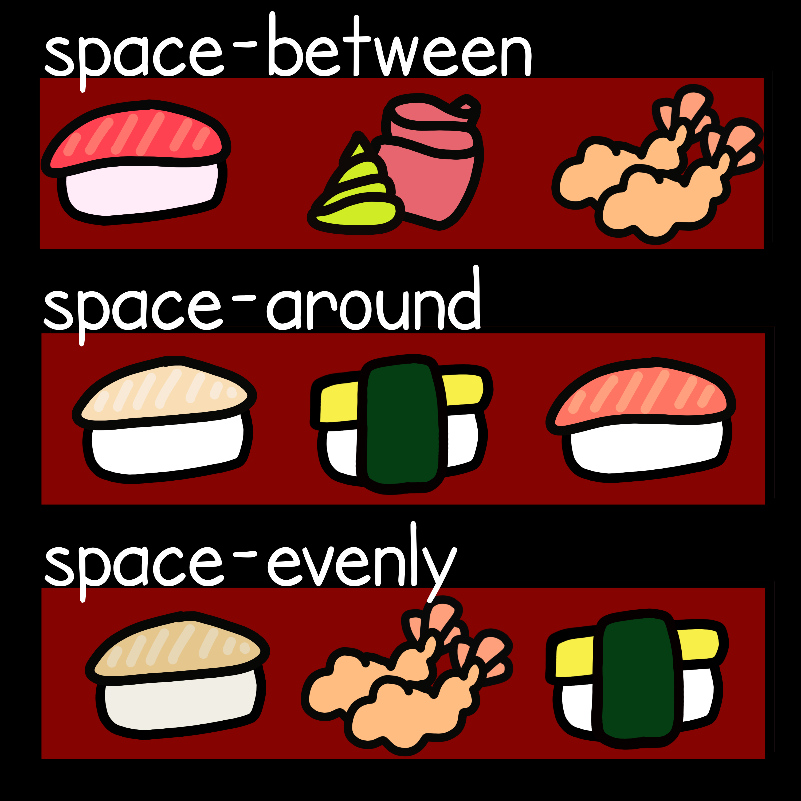
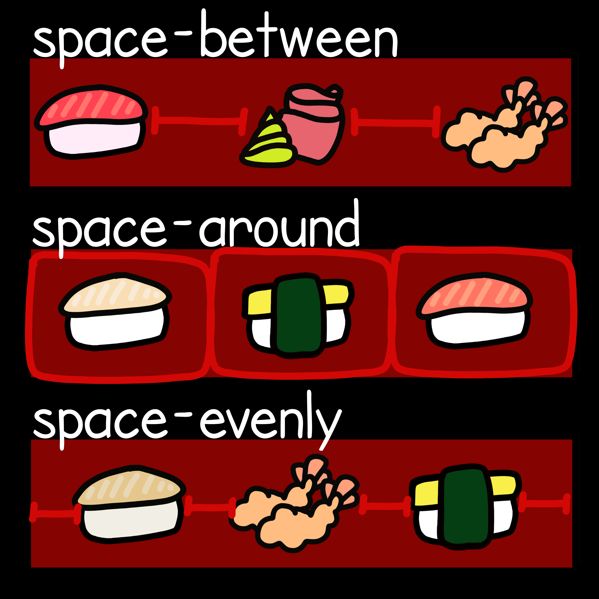

💻➡️ “The Flexible Box Module, usually referred to as #flexbox, was designed as a one-dimensional layout model, and as a method that could offer space distribution between items in an interface and powerful alignment capabilities.” - MDN

> Ever since I learned Flexbox 💻, I couldn’t stop thinking of bento 🍱 boxes.

> 🥢 Start with the CSS property justify-content:

> 🍣 Then add the CSS value that you want. 🍤

## space-between

items are evenly distributed in the line; first item is on the start line, last item on the end line

## space-around

items are evenly distributed in the line with equal space around them. Note that visually the spaces aren’t equal, since all the items have equal space on both sides. The first item will have one unit of space against the container edge, but two units of space between the next item because that next item has its own spacing that applies.

## space-evenly

items are distributed so that the spacing between any two items (and the space to the edges) is equal.

> Flexbox 🍱 is great for mobile screens 📱 and responsive content for dynamic layouts and webapps 🖥️.

## flex-start (default)

items are packed toward the start of the flex-direction.

## center

items are centered along the line

## flex-end

items are packed toward the end of the flex-direction.

> It's pretty easy, now you try! 😋
