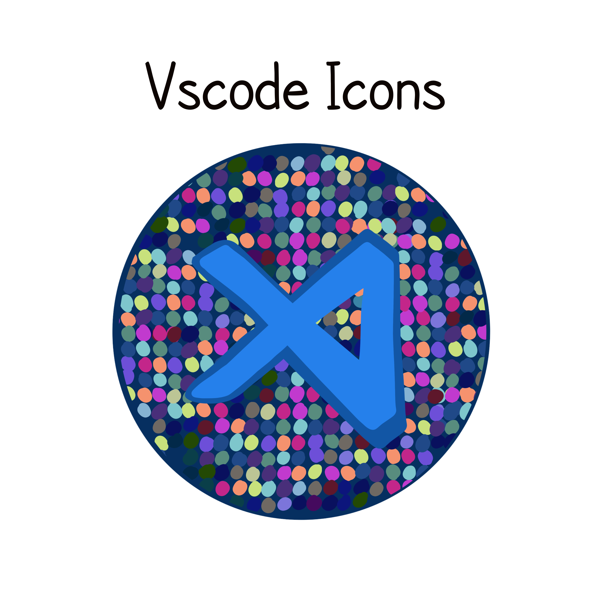

## Prettier is a helpful Visual Studio Code extension that helps your code look, well “prettier.” 😂 “It enforces a consistent style by parsing your code and re-printing it with its own rules that take the maximum line length into account, wrapping code when necessary.” 

> As a new developer, I really like it for the wrap utility so I can easily see all the code within the vscode window. 👍🏽
>

## This one is a cutie. 💙 This Visual Studio Code extension creates icons so you can see at a glance what file 📁 type you are working with. Extremely helpful when you begin to work on large projects with multiple folders with many file types.

## As a new babydev, it can be a challenge to navigate learning all the new technologies and knowing where to begin. If you’re using #VSCode (Visual Studio Code) to code #Javascript, one of the first extensions to download is Live Server. #Liveserver helps you quickly see your work in the browser through launching a local server. 

> An essential extension for the babydev programmer! ☝🏽
>

## Another handy extension for Visual Studio Code is Bracket Pair Colorizer. It helps make your bracket pairs more easy to see by matching their colors. 🌈 This is helpful so you can make sure all your syntax is there. 🔍

> Bracket Pair Colorizer 2 helps make your code more readable.
>
